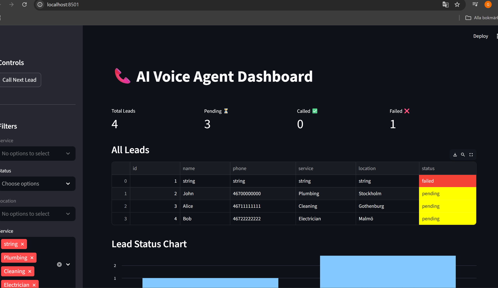
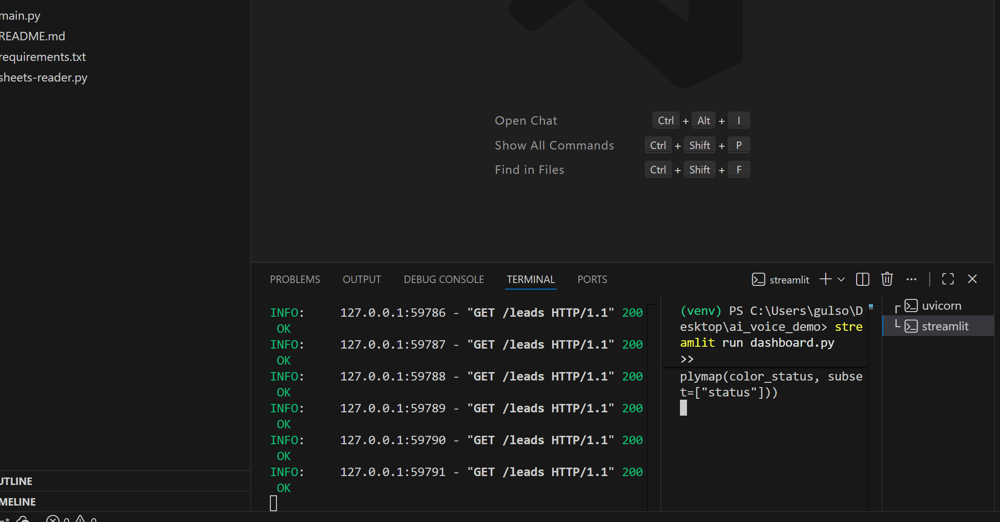
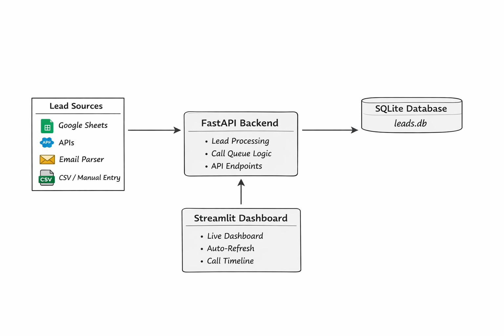

# 📞 AI Voice Agent Dashboard

A fully functional AI Voice Agent Dashboard to manage and simulate calls for leads. Built with **FastAPI**, **SQLite**, and **Streamlit**. This project demonstrates real-time lead management, queueing, and call simulation with a clean, interactive dashboard.

---

## 🌟 Features

- **Real-time lead management** with auto-refresh every 5 seconds  
- **Lead queue and status tracking** (pending, called, failed)  
- **Call simulation** with retry logic  
- **Timeline visualization** for call history  
- **Lightweight database** (SQLite) for storing leads  
- **Easy Google Sheets integration** (via API, optional)  

---

## 📸 Screenshots

### Dashboard with Auto-Refresh

### Call Timeline / Lead History

### Backend Leads Endpoint

---

## 🏗 Architecture Diagram

**Overview:**
1. **Google Sheets / API / Lead Sources** →  
2. **FastAPI Backend** → saves leads to **SQLite**, queues leads for calls →  
3. **Streamlit Dashboard** → displays leads, call statuses, timeline, and queue stats  

---

## ⚙️ Project Structure

# 📞 AI Voice Agent Dashboard

A fully functional AI Voice Agent Dashboard to manage and simulate calls for leads. Built with **FastAPI**, **SQLite**, and **Streamlit**. This project demonstrates real-time lead management, queueing, and call simulation with a clean, interactive dashboard.

---

## 🌟 Features

- **Real-time lead management** with auto-refresh every 5 seconds  
- **Lead queue and status tracking** (pending, called, failed)  
- **Call simulation** with retry logic  
- **Timeline visualization** for call history  
- **Lightweight database** (SQLite) for storing leads  
- **Easy Google Sheets integration** (via API, optional)  

---

## 📸 Screenshots

### Dashboard with Auto-Refresh

### Backend Leads Endpoint

---

## 🏗 Architecture Diagram

**Overview:**
1. **Google Sheets / API / Lead Sources** →  
2. **FastAPI Backend** → saves leads to **SQLite**, queues leads for calls →  
3. **Streamlit Dashboard** → displays leads, call statuses, timeline, and queue stats  

---

## ⚙️ Project Structure

ai-voice-agent-demo/
├── main.py # FastAPI backend
├── dashboard.py # Streamlit frontend
├── db.py # Database models & setup
├── requirements.txt # Python dependencies
├── README.md # This README
├── assets/ # Screenshots & diagrams
├── .gitignore # Ignore venv, secrets, temp files
└── leads.db # SQLite database (generated on run)